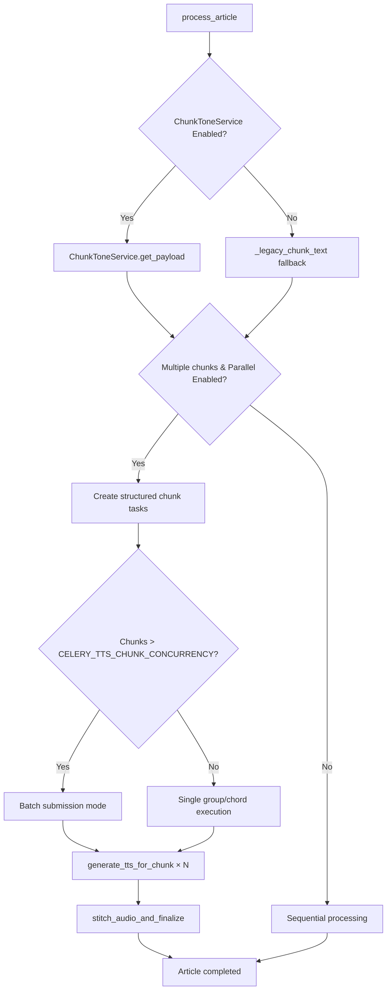

# Parallel TTS Processing Implementation

This document describes the parallel TTS processing implementation that enables multiple TTS chunks to be processed concurrently, significantly improving performance for long articles.

## Overview

The parallel TTS system replaces sequential chunk processing with a distributed task architecture using Celery groups and chords. This allows multiple audio chunks to be generated simultaneously while maintaining proper ordering and error handling.

**Important:** By default (`ENABLE_CHUNK_TONE_LLM=True`), the "chunks" processed in parallel are **not** simple text splits, but sophisticated, structured chunks generated by the `ChunkToneService`. These chunks include specific voice assignments, character names, and detailed instructions for each segment, enabling dynamic multi-voice narration within a single article.

## Architecture

### Core Components

1. **ChunkToneService** (`text_to_audio/services/chunk_tone_service.py`)
   - **Primary chunking mechanism** when `ENABLE_CHUNK_TONE_LLM=True` (default)
   - Intelligently analyzes text and creates structured chunks with:
     - Per-chunk voice assignments (character-specific voices)
     - Detailed instructions for tone and delivery
     - Character names and context awareness
   - Fallback: `_legacy_chunk_text` provides simple text splitting when ChunkTone is disabled or fails

2. **TTSRateLimiter** (`text_to_audio/rate_limiter.py`)
   - Redis-based distributed rate limiting
   - Two-level rate limiting (per-second and per-minute)
   - Prevents OpenAI API throttling across multiple workers

3. **Parallel Tasks** (`text_to_audio/parallel_tasks.py`)
   - `generate_tts_for_chunk`: Processes individual structured chunks (with voice/instructions)
   - `stitch_audio_and_finalize`: Combines chunks and finalizes articles

4. **Enhanced process_article** (`text_to_audio/tasks.py`)
   - Coordinator task that orchestrates parallel processing
   - Integrates with ChunkToneService to get structured chunks
   - Falls back to sequential processing when appropriate

### Task Flow



**Key Data Flow:**
- `ChunkToneService` produces structured chunks: `{text, voice, instructions, character_name}`
- `generate_tts_for_chunk` prioritizes per-chunk voice/instructions over global settings
- `_legacy_chunk_text` provides simple text splitting as fallback only
- **Batch mode**: Articles with more chunks than `CELERY_TTS_CHUNK_CONCURRENCY` are processed in sequential batches to prevent overwhelming the task queue

## Configuration

### Environment Variables

```bash
# Enable/disable intelligent chunking (default: true)
ENABLE_CHUNK_TONE_LLM=true

# Enable/disable parallel processing (default: true)
ENABLE_PARALLEL_TTS=true

# Maximum chunks submitted per batch for large articles
CELERY_TTS_CHUNK_CONCURRENCY=4

# Rate limiting settings
OPENAI_TTS_RATE_LIMIT_PER_MINUTE=50
OPENAI_TTS_RATE_LIMIT_PER_SECOND=3

# Worker configuration
CELERY_TTS_WORKER_CONCURRENCY=2

# TTS model (gpt-4o-mini-tts supports per-chunk instructions from ChunkToneService)
OPENAI_TTS_MODEL=gpt-4o-mini-tts
```

**Important Configuration Notes:**
- `ENABLE_CHUNK_TONE_LLM=true` enables the primary chunking mechanism with voice/instruction metadata
- `ENABLE_CHUNK_TONE_LLM=false` falls back to simple text splitting via `_legacy_chunk_text`
- Both settings work independently: you can have intelligent chunking with sequential processing
- Default TTS model is `gpt-4o-mini-tts` to support per-chunk instructions; use `tts-1` if instructions aren't needed

### Understanding `CELERY_TTS_CHUNK_CONCURRENCY`

This setting controls **client-side batch submission** for very large articles, NOT the overall system concurrency. The actual parallelism is determined by your `worker_tts` configuration.

**Worked Example:**
```
Article with 8 chunks:
- CELERY_TTS_CHUNK_CONCURRENCY=4
- 2 worker_tts processes running

Flow:
1. Article splits into 8 chunks from ChunkToneService
2. Client submits chunks in batches of 4 (due to CELERY_TTS_CHUNK_CONCURRENCY=4)
3. Batch 1: chunks 0,1,2,3 → sent to tts_chunks queue
4. Batch 2: chunks 4,5,6,7 → sent to tts_chunks queue after batch 1 completes
5. The 2 worker_tts processes handle actual parallel execution (up to 2 chunks simultaneously)
6. Final stitching combines all 8 chunks in order

The limiting factor for parallelism is the number of worker_tts processes, not CELERY_TTS_CHUNK_CONCURRENCY.
```

### Django Settings

The following settings are automatically configured from environment variables:

- `ENABLE_CHUNK_TONE_LLM`: Feature flag for intelligent chunking (ChunkToneService)
- `ENABLE_PARALLEL_TTS`: Feature flag for parallel processing
- `CELERY_TTS_CHUNK_CONCURRENCY`: Max chunks submitted per batch (for very large articles)
- `OPENAI_TTS_RATE_LIMIT_PER_MINUTE`: API rate limit per minute
- `OPENAI_TTS_RATE_LIMIT_PER_SECOND`: API rate limit per second
- `CELERY_TTS_WORKER_CONCURRENCY`: TTS worker pool size

## Deployment

### Docker Compose

The system includes dedicated worker pools:

- **worker_main**: Handles article processing, maintenance, and audio finalization
- **worker_tts**: Dedicated pool for TTS chunk generation

```yaml
worker_main:
  command: celery -A rss_tts worker -Q article_processing,maintenance,audio_processing -c 2

worker_tts:
  command: celery -A rss_tts worker -Q tts_chunks -c ${CELERY_TTS_WORKER_CONCURRENCY:-2}
```

### Queue Configuration

Tasks are routed to specific queues:

- `tts_chunks`: TTS chunk generation
- `audio_processing`: Audio stitching and finalization
- `article_processing`: Main article processing
- `maintenance`: Background maintenance tasks

## Rate Limiting

### Implementation

The rate limiter uses Redis sliding window counters to enforce limits:

- **Per-second limiting**: Prevents burst API calls (default: 3 requests/second)
- **Per-minute limiting**: Enforces sustained rate limits (default: 50 requests/minute)
- **Distributed**: Works across multiple worker instances
- **Single source of truth**: Redis-based rate limiting replaces Celery task-level rate limits for better coordination
- **Fail-open behavior**: If Redis is unavailable, requests are allowed to prevent service outage (warnings logged once per minute)

### Usage

```python
from text_to_audio.rate_limiter import get_rate_limiter

rate_limiter = get_rate_limiter()
if rate_limiter.acquire_tts_token(timeout=60.0):
    # Make TTS API call
    pass
```

## Error Handling

### Chunk-Level Failures

- Individual chunk failures don't stop processing
- Retries with exponential backoff for transient errors
- Rate limit errors trigger longer delays

### Article-Level Failures

- If majority of chunks fail: Article marked as FAILED
- If minority fail: Article completes with warnings
- All chunks fail: Article marked as FAILED

### Graceful Degradation

- Falls back to sequential processing for single chunks
- Disables parallel processing via `ENABLE_PARALLEL_TTS=false`
- Continues with available chunks if some fail

## Performance Benefits

### Speed Improvements

- **4x faster** for articles with 4+ chunks (with default concurrency=4)
- Scales with `CELERY_TTS_CHUNK_CONCURRENCY` setting
- Maintains sequential performance for short articles

### Resource Usage

- Dedicated TTS worker pool prevents blocking other tasks
- Redis-based rate limiting prevents API quota exhaustion
- Configurable concurrency limits resource consumption

## Monitoring

### Metrics to Track

1. **Task Metrics**
   - TTS chunk success/failure rates
   - Average chunk processing time
   - Queue depth for `tts_chunks` queue
   - Chunk failure counts per article
   - Partial completion occurrences (articles with processing_notes)

2. **Rate Limiting Metrics**
   - Rate limit acquisition success/failure/timeout counters
   - Average wait time for rate limit tokens
   - API quota utilization
   - Redis failover events (fail-open occurrences)

3. **Performance Metrics**
   - End-to-end article processing time
   - Parallel vs sequential processing time comparison
   - Worker utilization rates
   - Batch processing efficiency (when CELERY_TTS_CHUNK_CONCURRENCY exceeded)

4. **System Health Metrics**
   - Redis connection status
   - Worker pool availability (worker_tts vs worker_main)
   - Temporary file cleanup success rates
   - Audio stitching success rates

### Logging

Enhanced logging provides visibility into parallel processing:

```
INFO: Starting parallel TTS processing for 8 chunks
INFO: TTS Chunk 0 API Call - Article 123, model=tts-1, voice=alloy
INFO: TTS chunk 0 completed successfully in 1234ms
INFO: Parallel TTS completed: Article 123 finalized successfully
```

### Future Monitoring Integration

The parallel TTS system is designed to integrate with monitoring solutions:

1. **Prometheus/Grafana**
   - Custom metrics can be exposed via Django Prometheus exporter
   - Dashboard templates for visualizing TTS performance
   - Alerting on rate limit failures or chunk failure rates

2. **Sentry Integration**
   - Error tracking for failed chunks and partial completions
   - Performance monitoring for slow TTS operations
   - Release tracking for parallel TTS feature rollouts

3. **Custom Dashboards**
   - Real-time queue depth monitoring
   - Rate limiter utilization graphs
   - Worker pool health indicators
   - Processing time distributions

4. **Alerting Scenarios**
   - High chunk failure rates (>20% for sustained periods)
   - Redis rate limiter consistently failing open
   - Worker pools becoming unavailable
   - Queue depths exceeding thresholds

## Testing

### Test Coverage

The implementation includes comprehensive tests:

- `test_parallel_tts.py`: Unit tests for all components
- Rate limiter functionality
- Chunk generation and error handling
- Audio stitching with various failure scenarios
- Integration tests for parallel processing

### Running Tests

```bash
# Run parallel TTS tests
python manage.py test tests.text_to_audio.test_parallel_tts

# Run all tests
python manage.py test
```

## Troubleshooting

### Common Issues

1. **Rate Limiting**
   - Check Redis connectivity
   - Verify `OPENAI_TTS_RATE_LIMIT_*` settings
   - Monitor API usage in OpenAI dashboard

2. **Worker Issues**
   - Ensure `worker_tts` container is running
   - Check worker logs for errors
   - Verify queue routing configuration

3. **Performance Issues**
   - Adjust `CELERY_TTS_CHUNK_CONCURRENCY`
   - Monitor Redis performance
   - Check network latency to OpenAI API

### Debug Mode

To disable parallel processing for debugging:

```bash
export ENABLE_PARALLEL_TTS=false
```

This forces sequential processing while maintaining the same code path.

## Migration Notes

### Backward Compatibility

- Existing articles continue to work unchanged
- No database migrations required
- Can be deployed incrementally

### Rollback

To rollback to sequential processing:

1. Set `ENABLE_PARALLEL_TTS=false`
2. Remove `worker_tts` from docker-compose.yml
3. Revert `worker` to handle all queues

## Future Enhancements

### Planned Improvements

1. **Auto-scaling**: Dynamic worker scaling based on queue depth
2. **Priority queues**: High-priority articles processed first
3. **Batch optimization**: Intelligent batching for optimal performance
4. **Metrics dashboard**: Real-time monitoring and alerting

### Configuration Options

1. **Per-feed concurrency**: Different limits per feed
2. **Time-based limits**: Quieter processing during peak hours
3. **Cost optimization**: Balance speed vs API costs

## Security Considerations

### API Key Protection

- Rate limiting prevents API key abuse
- Redis authentication in production
- Secure inter-service communication

### Resource Limits

- Worker memory limits prevent resource exhaustion
- Queue size limits prevent unbounded growth
- Timeout configurations prevent hanging tasks
