# RSS-TTS Pipeline Diagram

This diagram shows the complete pipeline from input sources through to audio completion and podcast distribution.

```mermaid
graph TB
    %% Input Sources
    subgraph "Input Sources"
        URL[URL Input]
        TEXT[Direct Text Input]
        FILE[File Upload<br/>PDF/HTML]
        RSS[RSS Feed<br/>Auto-import]
    end

    %% Entry Points
    subgraph "Entry Points"
        WEB[Web Interface<br/>Django Views]
        API[REST API<br/>v1/feeds/token/articles]
        TASK[Celery Task<br/>import_followed_feeds]
    end

    %% Content Processing
    subgraph "Content Preparation"
        EXTRACT[Content Extraction<br/>GPT-4.1 + BeautifulSoup]
        VALIDATE[Content Validation<br/>30k word limit]
        ARTICLE[Article Model<br/>PROCESSING status]
    end

    %% Voice Configuration
    subgraph "Voice Configuration"
        VOICE_MODE{{Voice Mode}}
        SINGLE_DEFAULT[Single Default<br/>Tone mapping]
        SINGLE_CUSTOM[Single Custom<br/>User preset]
        AUTO[Auto Mode<br/>AI-driven analysis]
    end

    %% Content Analysis
    subgraph "Content Analysis"
        ANALYSIS[ContentAnalysisService<br/>GPT-4.1 analysis]
        VOICE_PARAMS[VoiceParameterService<br/>Enhanced prompts]
        MULTI_VOICE[Multi-voice JSON<br/>Character detection]
    end

    %% Audio Generation Tiers
    subgraph "Audio Generation (Tiered)"
        TIER1[Tier 1: ChunkTone Service<br/>Advanced multi-voice]
        TIER2[Tier 2: Legacy Multi-voice<br/>Content analysis based]
        TIER3[Tier 3: Single-voice<br/>Fallback guaranteed]
    end

    %% TTS Processing
    subgraph "TTS Processing"
        CHUNK[Text Chunking<br/>4000 chars + natural breaks]
        OPENAI[OpenAI TTS API<br/>tts-1 / tts-1-hd]
        VOICES[Voice Selection<br/>alloy, nova, onyx, etc.]
    end

    %% Audio Processing
    subgraph "Audio Processing"
        STITCH[Audio Stitching<br/>pydub concatenation]
        ENHANCE[Audio Enhancement<br/>+3dB boost, 44.1kHz]
        METADATA[ID3 Metadata<br/>Title, artist, album]
        SAVE[Save MP3<br/>/media/articles/uuid.mp3]
    end

    %% Output & Distribution
    subgraph "Output & Distribution"
        COMPLETE[Article Status<br/>COMPLETED]
        CADDY[Caddy Static Serving<br/>Byte-range support]
        RSS_FEED[RSS Feed Generation<br/>Podcast compatible]
        PODCAST[Apple Podcasts<br/>Compatible delivery]
    end

    %% Flow connections
    URL --> WEB
    TEXT --> WEB
    FILE --> WEB
    URL --> API
    TEXT --> API
    RSS --> TASK

    WEB --> EXTRACT
    API --> EXTRACT
    TASK --> EXTRACT

    EXTRACT --> VALIDATE
    VALIDATE --> ARTICLE

    ARTICLE --> VOICE_MODE
    VOICE_MODE --> SINGLE_DEFAULT
    VOICE_MODE --> SINGLE_CUSTOM
    VOICE_MODE --> AUTO

    SINGLE_DEFAULT --> TIER3
    SINGLE_CUSTOM --> TIER3
    AUTO --> ANALYSIS

    ANALYSIS --> VOICE_PARAMS
    ANALYSIS --> MULTI_VOICE
    VOICE_PARAMS --> TIER1
    MULTI_VOICE --> TIER1

    TIER1 --> CHUNK
    TIER1 -.->|fallback| TIER2
    TIER2 --> CHUNK
    TIER2 -.->|fallback| TIER3
    TIER3 --> CHUNK

    CHUNK --> OPENAI
    OPENAI --> VOICES
    VOICES --> STITCH

    STITCH --> ENHANCE
    ENHANCE --> METADATA
    METADATA --> SAVE

    SAVE --> COMPLETE
    COMPLETE --> CADDY
    CADDY --> RSS_FEED
    RSS_FEED --> PODCAST

    %% Style the diagram
    classDef inputClass fill:#e1f5fe,stroke:#0277bd,stroke-width:2px
    classDef processClass fill:#f3e5f5,stroke:#7b1fa2,stroke-width:2px
    classDef outputClass fill:#e8f5e8,stroke:#388e3c,stroke-width:2px
    classDef fallbackClass fill:#fff3e0,stroke:#f57c00,stroke-width:2px

    class URL,TEXT,FILE,RSS inputClass
    class EXTRACT,VALIDATE,ARTICLE,ANALYSIS,CHUNK,OPENAI,VOICES,STITCH,ENHANCE,METADATA,SAVE processClass
    class COMPLETE,CADDY,RSS_FEED,PODCAST outputClass
    class TIER1,TIER2,TIER3 fallbackClass
```

## Key Pipeline Features

**Multiple Input Paths:**
- Web interface for manual article submission
- REST API for programmatic access
- Automated RSS feed ingestion

**Intelligent Processing:**
- GPT-4.1 content extraction with BeautifulSoup fallback
- Three-tier audio generation system with graceful degradation
- AI-driven voice configuration and multi-voice support

**Production-Ready Output:**
- Caddy-served audio files with Apple Podcasts compatibility
- Comprehensive metadata and RSS feed generation
- Robust error handling and fallback mechanisms

The diagram shows how the system handles different input types, processes them through various voice configuration modes, and generates high-quality audio files through a sophisticated multi-tier approach that ensures completion even if advanced features fail.

## Pipeline Stages

1. **Input Sources**: URL, text, file upload, or RSS feed
2. **Entry Points**: Web interface, REST API, or background tasks
3. **Content Preparation**: Extraction, validation, and article creation
4. **Voice Configuration**: Single default, custom preset, or AI-driven auto mode
5. **Content Analysis**: GPT-4.1 analysis for multi-voice and enhanced prompts
6. **Audio Generation**: Three-tier system with fallback guarantees
7. **TTS Processing**: Text chunking, OpenAI API calls, voice selection
8. **Audio Processing**: Stitching, enhancement, metadata, file saving
9. **Output & Distribution**: Completion status, Caddy serving, RSS generation, podcast delivery
